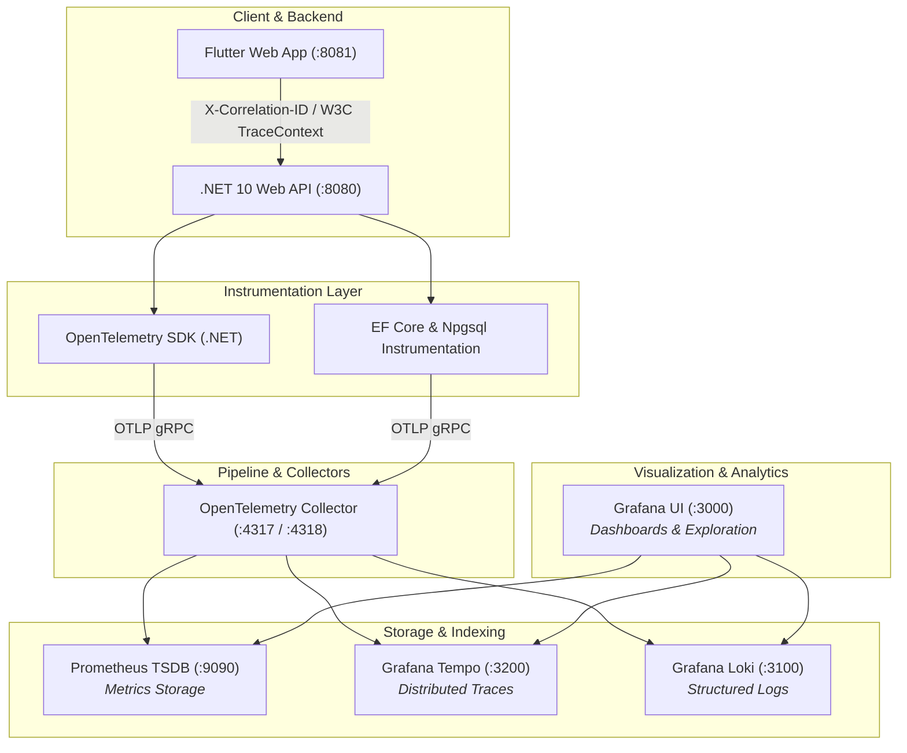

# InOut Stack Observability Guide & Operational Capabilities

This guide provides a comprehensive manual on how to use the **InOut** Observability stack (**OpenTelemetry**, **Prometheus**, **Grafana Tempo**, **Grafana Loki**, and **Grafana Dashboards**) to monitor, debug, and optimize the application.

---

## 🏗️ Architecture Overview



---

## 🎯 What You Can Do with the Observability Stack

### 1. Distributed Tracing with Grafana Tempo
* **End-to-End Execution Flow**: Visualize the exact path of an HTTP request as it flows through ASP.NET Core middleware, authorization, business logic, EF Core queries, and PostgreSQL execution.
* **Latency Breakdown & Bottleneck Identification**: See the exact duration (in milliseconds) spent in each layer of a request (e.g., 5ms in API middleware vs. 450ms waiting for a database query).
* **Database Query Inspection**: Inspect full raw SQL statements executed by EF Core, including parameter values, connection acquisition time, and PostgreSQL execution spans.
* **Flamegraph & NodeGraph Topology**: View visual graph diagrams of microservices and database calls to spot unexpected cascading queries or redundant database calls (N+1 queries).

---

### 2. Log Aggregation & Log-to-Trace Drilldown with Loki
* **Unified Real-time Log Streaming**: View logs from all API instances, background jobs, and system containers in a single centralized timeline without using `docker logs`.
* **1-Click Log-to-Trace Navigation**: Click any `TraceID` link inside a Loki log entry to jump directly to the exact distributed trace in Grafana Tempo.
* **Structured Filtering & Search**: Query logs by specific metadata:
  - `Correlation-ID` (e.g., `CorrelationId: e55cb19d...`)
  - `SqlState` (e.g., PostgreSQL error codes like `42501` for permission denied)
  - `ExceptionType` (e.g., `BadHttpRequestException`, `PostgresException`)
  - `StatusCode` (e.g., `500`, `401`, `404`)

---

### 3. Application & Infrastructure Metrics with Prometheus
* **RED Metrics (Rate, Errors, Duration)**:
  - **Rate**: Monitor request throughput per second across all endpoints.
  - **Errors**: Track 4xx and 5xx error rates in real-time.
  - **Duration**: Monitor latency histograms (p50, p95, p99 percentiles).
* **Database & Connection Pool Health**:
  - Monitor active vs. idle database connections in Npgsql connection pool.
  - Track connection acquisition wait times and prevent connection leaks.
* **.NET Runtime & Garbage Collection Diagnostics**:
  - Monitor .NET Garbage Collection (Gen 0, Gen 1, Gen 2 collections).
  - Detect ThreadPool starvation, CPU usage spikes, and memory growth.

---

### 4. Visualization & Alerting with Grafana
* **Pre-built Main Dashboard (`InOut API & Infrastructure Observability`)**:
  - **Panel 1**: HTTP Request Volume & 5xx Error Rate.
  - **Panel 2**: API Request Latency (p50, p95, p99 distribution).
  - **Panel 3**: Real-time Log Stream with inline Trace links.
* **Custom Alerting Rules**: Configure automated notifications (via Slack, Discord, Email, PagerDuty) for:
  - High 5xx HTTP Error Rate (>5% over 5 minutes).
  - High Latency (>1 second on critical endpoints).
  - Database Permission Failures or RLS Policy Violations (`SqlState: 42501`).

---

## 🛠️ Practical Troubleshooting Scenarios

### Scenario 1: Debugging a "500 Internal Server Error"

When a user or developer sees a 500 error in the browser:

1. **Get the Correlation ID**:
   - Look at the HTTP response header `X-Correlation-ID` or the JSON body:
     ```json
     {
       "status": 500,
       "title": "An unexpected error occurred. Use the correlation ID to report it.",
       "traceId": "93e525345c40e306ffc54dbacb2ec3d4"
     }
     ```
2. **Search in Grafana Explore**:
   - Go to `http://localhost:3000` -> **Explore**.
   - Select data source **Tempo** -> Paste the `traceId` (`93e525345c40e306ffc54dbacb2ec3d4`).
3. **Analyze the Trace**:
   - Expand the failed span marked in **Red**.
   - Read the exact exception message, stack trace, and parameters.

---

### Scenario 2: Investigating Database Permission Errors (`42501`)

If an endpoint fails due to PostgreSQL RLS or table permissions:

1. Open **Grafana Explore** -> Select **Loki**.
2. Run the LogQL query:
   ```logql
   {job=~".+"} |= "SqlState: 42501"
   ```
3. Expand the log entry to see:
   - The exact table name causing the issue (e.g., `permission denied for table budgets`).
   - The `TraceId` link. Click the `TraceId` link to view the exact SQL query that triggered the permission denial.

---

### Scenario 3: Spotting Slow Database Queries & Performance Bottlenecks

1. Open Grafana Dashboard **`InOut API & Infrastructure Observability`**.
2. Check the **API Request Latency** panel for spikes in `p95` or `p99`.
3. Switch to **Explore** -> Select **Tempo** -> Filter by **Min Duration: 500ms**.
4. Click on any slow trace to view the timeline bar chart showing which database query took the longest time to execute.

---

## 📌 Access Endpoints & Credentials Cheat Sheet

| Component | URL / Endpoint | Credentials / Details |
| :--- | :--- | :--- |
| **Grafana UI** | `http://localhost:3000` | User: `admin` \| Password: `admin` |
| **Grafana Dashboard** | `http://localhost:3000/dashboards` | Dashboard UID: `inout-observability-main` |
| **Prometheus UI** | `http://localhost:9090` | Targets: `api:8080`, `otel-collector:8889` |
| **API Prometheus Metrics** | `http://localhost:8080/metrics` | Prometheus format metrics endpoint |
| **OTel Collector gRPC** | `http://localhost:4317` | OTLP gRPC ingestion port |
| **OTel Collector HTTP** | `http://localhost:4318` | OTLP HTTP ingestion port |
| **Loki Log Engine** | `http://localhost:3100` | Ingestion & LogQL query endpoint |
| **Tempo Trace Engine** | `http://localhost:3200` | Trace storage & search endpoint |
